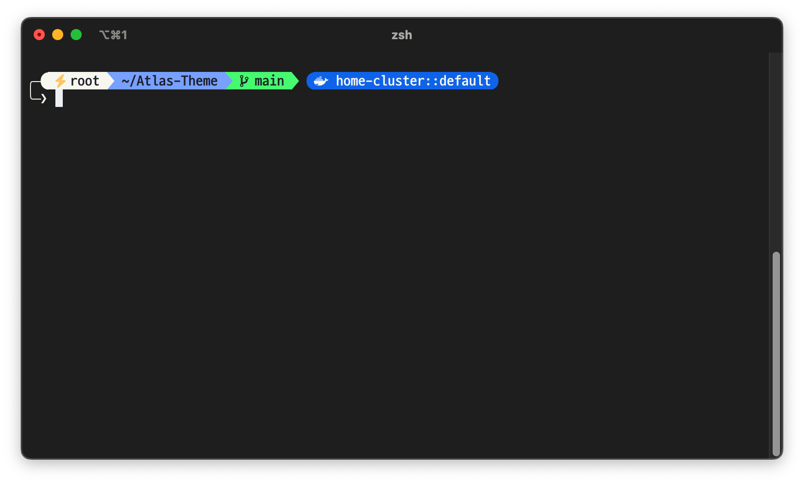

# Atlas Theme for Oh My Posh

|||
|:---:|:---:|

깔끔하고 심플한 [Oh My Posh](https://ohmyposh.dev/) 테마로, Dracula+ 색상 조합과 D2Coding Ligature Nerd Font를 추천합니다.

## 📸 미리보기

이 테마는 다음 정보를 표시합니다:
- ⚡️ Root 권한 표시
- 👤 사용자 이름 및 명령 실행 상태
- 📁 현재 경로
- 🌿 Git 브랜치 및 상태
- 🐍 Python 가상환경 (활성화 시)
- ☸️ Kubernetes 컨텍스트 및 네임스페이스 (설정 시)

## 🎨 색상 조합

### Dracula+ 색상 팔레트
- **배경색**: `#212121`
- **전경색**: `#F8F8F2`
- **빨강**: `#FF5555`
- **초록**: `#50FA7B`
- **노랑**: `#FFCB6B`
- **파랑**: `#82AAFF`
- **보라**: `#C792EA`
- **청록**: `#8BE9FD`

## 🔤 폰트

**D2 Coding Ligature Nerd Font**
- [D2 Coding Font](https://github.com/naver/d2codingfont)
- [Nerd Fonts](https://www.nerdfonts.com/)

## 추천 확장 기능
- `zsh-highlighting`
- `zsh-autosuggestions`
- `fzf`
- `eza`